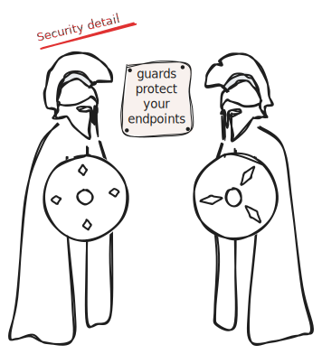

[gregoryv/htsec](https://pkg.go.dev/github.com/gregoryv/htsec) provides handler security using oauth2

The security detail, with it's guards, protect your handlers.
In the oauth2 flow the state parameter is signed and verified.

## Quick start

    go get github.com/gregoryv/htsec
	
